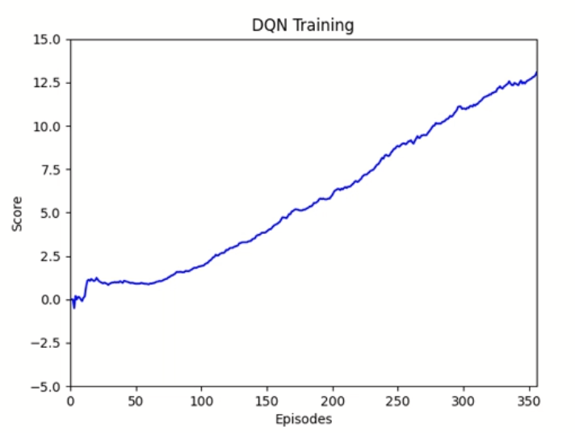

## Project Navigation - Report

### Q-learning
The agent was trained using Double DQN which is a variant of Deep Q-learning.
The main idea is to use deep neural networks to estimate a value function for the possible states and actions of the environment.
With DQN only, the Q-learning can over-estimate the action values because the next best approximated action is evaluated using the same policy that is being updated.
Double DQN addresses this issue by using two separate value functions for action selection and action evaluation.
Also, in order to address the issue of the correlation between consecutive sampled states, we use an experience replay buffer.
The inputs for the learning are randomly selected batches from the replay buffer.
This also allows for the same state to be used multiple times during training.
It is also worth noting that we use epsilon greedy exploration that starts at 1 and slowly decays to a minimum of 0.01.

### Network Architecture
We use a simple deep neural network with two hidden layers:
* Input size: 37, same as state size
* First layer: fully connected of size 128, with relu activation
* Second layer: fully connected of size 128, with relu activation
* Output layer: fully connected of size 4, same as action size

### Hyper-parameters
The following hyper-parameters were used for training:

| Parameter | Value | Description |
| --------- | ----- | ----------- | 
| BUFFER_SIZE | 100000 | Maximum of the replay buffer |
| BATCH_SIZE | 256 | Size of the batch of experiences to use for learning |
| LEARNING_RATE | 0.0001 | Learning rate for the Q-network optimizer |
| TAU | 0.001 | Coefficient for soft update of network weights |
| GAMMA | 0.99 | Future rewards discounting |
| FC1_UNITS | 128 | Size of first fully connected layer |
| FC2_UNITS | 128 | Size of second fully connected layer |
| UPDATE_EVERY | 4 | Frequency for training, skipping similar consecutive states |
| EPS_INIT | 1.0 | Initial value for random exploration |
| EPS_DECAY | 0.995 | Multiplicative decay |
| EPS_MIN | 0.01 | Minimum value for random exploration |

### Results
We consider the problem solved when the agent reaches an average score over 13 for the last 100 episodes.
The agent was able to solve the environment in 356 episodes as shown in the following figure:

You can also see a recorded video of the training on Youtube here:

[Youtube Video](https://youtu.be/YsK8oyWvXtA) (fast-forward 8x).

### Ideas for improvement
There are different improvements for DQN that we can explore like Dueling DQN or Prioritized Experience Replay. 
We can also try Rainbow which combines multiple improvements together.
